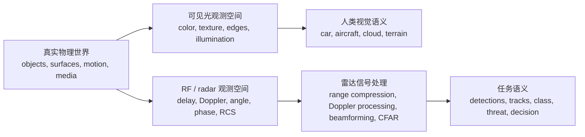
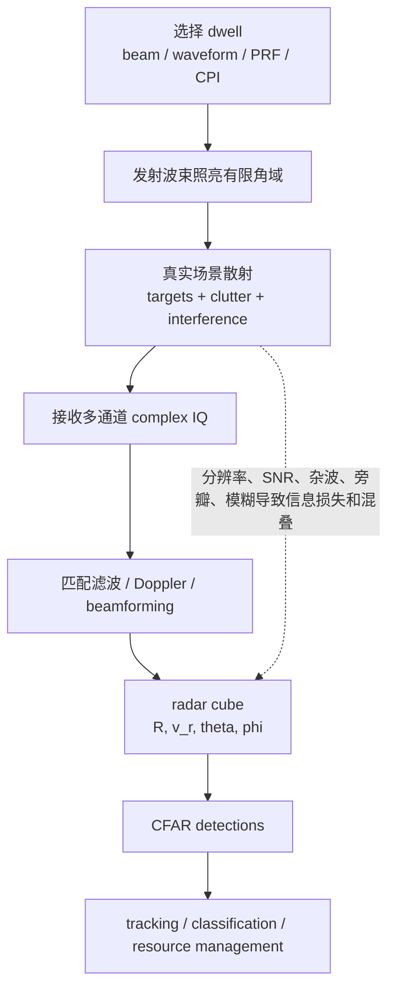

# 雷达作为 RF 世界的语义投影

相关笔记：[[0 phased array radar mental models]]

## Key takeaways

- 真实物理世界不是被任何传感器直接读取的；传感器只能通过自己的 observation mechanism 得到 world state 的某个投影。
- visible-band observation 和 RF / radar observation 都是在测量同一个真实世界，但它们落在不同的 measurement space 中。
- 不同 measurement space 会自然地产生不同 semantics：可见光更接近 color / texture / edge，雷达更接近 delay / Doppler / angle / phase / RCS。
- 一次 dwell 得到的不是“物体本身”，而是有限角域内散射、杂波、噪声、干扰叠加后的 complex IQ evidence。
- 雷达处理的本质，是把 RF measurement space 中的结构映射成 human / task semantics，例如 detections、tracks、class、threat、decision。

---

## 1. 核心观点

雷达不是在“拍摄真实世界本身”。一次 dwell / CPI 中，雷达真正做的是：

> **用一个发射波束照亮有限角域，用接收阵列采集这个角域内所有散射体、杂波、噪声和干扰叠加后的 complex IQ，再通过信号处理把这些 RF measurement 转换成 detections、tracks 和任务语义。**

所以雷达在一个 dwell 中“看到”的东西，肯定不是一个完美的真实世界图像。它受到很多限制：

- 发射波束只能覆盖有限空间区域；
- 距离分辨率由带宽限制；
- 角度分辨率由孔径和波长限制；
- 速度分辨率由 CPI 限制；
- 弱小目标可能被 clutter / noise / sidelobes 掩盖；
- range ambiguity、Doppler ambiguity、multipath 会制造混叠或 ghost。

因此，雷达得到的是一个被 RF 传播、散射、硬件和信号处理链共同塑造过的观测世界。

但这不应该被简单理解成“雷达看到的是更差的视觉图像”。更准确地说：

> **雷达看到的是同一个真实世界在 RF 测量空间中的投影；可见光视觉看到的是同一个真实世界在 visible-band 测量空间中的投影。**

两者不是谁完全替代谁，而是同一个世界的不同侧面。

---

## 2. 真实世界、可见光世界、RF 世界

可以想象有一个底层的真实物理世界：

$$
\text{world state}
=
\{\text{objects, surfaces, materials, motion, media, geometry}\}
$$

不同传感器并不直接读取这个 world state，而是通过各自的物理机制得到观测。

可见光视觉主要测到：

- visible-band radiance；
- color / texture / edge；
- illumination and shadow；
- 表面反射特征。

雷达主要测到：

- propagation delay；
- Doppler phase rotation；
- array-space phase slope；
- complex scattering amplitude；
- RCS / micro-Doppler / polarization response；
- clutter and interference structure。

所以，人眼更自然地获得“形状、颜色、纹理、边界”的语义；雷达更自然地获得“距离、径向速度、角度、散射强度、相干相位结构”的语义。



这张图的重点是：visible world 和 RF world 都不是完整真实世界本身，而是同一个真实世界经过不同物理测量机制后的结果。

---

## 3. 一次 dwell 到底获得了什么

一次 dwell 并不是得到“一个物体列表”。更底层地说，它得到的是一组多通道、跨脉冲、跨 fast-time sample 的 complex IQ 数据：

$$
X[m,p,n]
$$

其中：

- $m$ 是 array channel；
- $p$ 是 pulse index / slow time；
- $n$ 是 fast-time sample。

一个理想点目标在这些数据里的表现可以压缩成一句话：

> **一个散射点 = delayed waveform + Doppler phase rotation + array phase slope + complex scattering coefficient。**

也就是：

```text
delay
+ Doppler phase rotation
+ array-space phase slope
+ complex amplitude
```

但是现实中，雷达收到的不是单个散射点，而是很多目标、地面、海面、天气、干扰、噪声的叠加：

$$
X
\approx
\sum_q
\text{target/scatterer template}_q
+
\text{clutter}
+
\text{interference}
+
\text{noise}
$$

所以信号处理不是“把照片变清楚”，而是：

> **在 complex IQ 的高维数据里寻找和目标物理模型相匹配的结构。**



---

## 4. 为什么雷达世界会和人类直觉不同

雷达世界和人类视觉直觉不同，主要不是因为雷达“看不清”，而是因为它的测量变量本来就不同。

典型差异包括：

| 现象 | 对雷达语义的影响 |
| --- | --- |
| 距离分辨率有限 | 距离接近的散射体会落入同一个 range cell |
| 角度分辨率有限 | 同一波束或同一角度 bin 内的多个物体可能混在一起 |
| Doppler 分辨率有限 | 径向速度相近的散射体可能难以区分 |
| SNR 不足 | 弱目标可能无法超过检测门限 |
| clutter masking | 目标回波被地杂波、海杂波、天气杂波淹没 |
| sidelobes | 强目标或强杂波可能从旁瓣进入，造成假象 |
| ambiguity | range / Doppler 可能出现模糊，需要额外解模糊 |
| multipath | 多径反射可能导致 ghost target 或测量偏差 |

这意味着 radar cube 里的一个亮点不一定是一个真实目标；没有亮点也不代表真实世界里没有目标。

> **radar measurement 是证据，不是真相本身。**

---

## 5. 雷达处理的真正目标

雷达信号处理和数据处理的最终目标，不是恢复一张类似人眼图像的图片，而是从 RF measurement 推断对任务有用的 latent world state。

这个过程可以理解成：

$$
\text{RF measurements}
\rightarrow
\text{detections}
\rightarrow
\text{tracks}
\rightarrow
\text{classification / intent / decision}
$$

也可以理解成一个 inverse problem + decision problem：

- inverse problem：从回波反推出 range、velocity、angle、RCS、轨迹状态等隐藏变量；
- decision problem：在不确定性下判断是否检测、是否确认、是否建立 track、下一次 dwell 看哪里。

这里的“语义”不一定是人类视觉语义。人类可能关心：

- 这是不是飞机；
- 这是不是车；
- 这是不是云、雨、海浪或地物。

但雷达系统更常需要的是任务语义：

- detection 是否可信；
- track state 是什么；
- covariance 有多大；
- target class 是什么；
- threat level 如何；
- 是否值得分配更多 dwell；
- 是否满足 engagement quality。

所以，更准确的说法是：

> **雷达处理不是把 RF 世界翻译成人眼图像，而是把 RF 世界翻译成任务可用的状态估计和决策信息。**

---

## 6. 最终 mental model

可以把这个理解压缩成几句话：

- **真实世界不是被任何传感器直接读取的；每种传感器都只是通过某个物理频段和测量机制观察世界的一个投影。**
- **可见光视觉得到的是 visible-band semantics；雷达得到的是 RF scattering semantics。**
- **一次 dwell 获得的不是对象本身，而是有限角域内所有散射、杂波、噪声、干扰叠加后的 complex IQ evidence。**
- **range-Doppler-angle processing、CFAR、tracking、classification 的共同目的，是从 RF evidence 推断 latent world state。**
- **雷达系统最终输出的价值，不在于像不像人眼图像，而在于能否稳定地产生对任务有用的 detections、tracks、分类和决策。**

最短版本：

> **雷达不是拍摄世界，而是用 RF 波形和孔径对真实世界做受限的相干测量；信号处理和数据处理的任务，是把这个 RF 测量空间中的结构，推断成对人或系统有意义的目标、状态和决策。**
