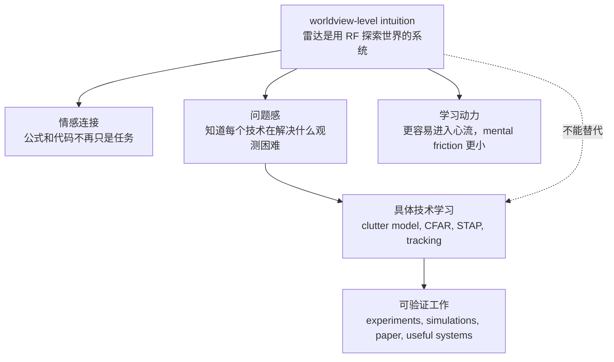

# 这种雷达 intuition 的意义

相关笔记：[[1 radar as RF semantic projection]]

## Key takeaways

- 这种 worldview-level intuition 不是 technical contribution，不能直接替代 clutter model、CFAR、STAP、实验或 paper work。
- 它的直接价值是建立情感连接：让公式、代码、硬件和算法不再只是 dry external tasks，而是一套用 RF 探索世界的系统。
- 它能降低 mental friction，让学习更容易进入 flow state，也让长期停留在问题里变得更自然。
- 它的间接价值是改变提问方式：从“怎么背公式 / 跑代码”转向“这个技术在 RF measurement space 中增强什么、压制什么、推断什么”。
- 真正的研究贡献仍然要落到具体数学、具体算法、具体数据和具体验证上；intuition 的作用是让这些工作更有方向和意义。

---

## 1. 它不是直接的 technical contribution

这种级别的理解很重要，但它不是直接的技术贡献。

它不能直接回答：

- clutter 到底应该怎么建模；
- 某个 clutter model 在什么条件下成立；
- 目前的数学模型能不能把真实杂波描述得足够好；
- CFAR、STAP、tracking、classification 具体应该怎么设计；
- paper 的 novelty 应该落在哪里；
- 一个系统怎样通过实验验证。

换句话说，仅仅知道：

> **雷达是用 RF 频段的电磁波观察真实世界的一个侧面。**

并不能自动产出模型、算法、实验或 paper。

如果停在这个层级，它只是一个 high-level story。真正能完成工作、发 paper、做出有用系统的，仍然是具体的数学建模、算法实现、数据分析、仿真和实验验证。

所以这个 intuition 不能替代 technical work。

但它可以改变 technical work 在心里的意义。

---

## 2. 它的直接价值：建立情感连接

这种 intuition 最直接的价值，是让自己和冰冷的数学公式、代码、硬件、算法之间建立一种情感上的连接。

没有这种理解时，看到的东西可能是：

```text
公式
参数
代码
算法步骤
工程约束
paper 里的 notation
```

这些东西容易显得 dry、boring、功利，像是一堆必须完成的任务。

有了这种 worldview-level understanding 以后，同样的东西会变成：

```text
一套用 RF 波探索世界、压缩世界、推断世界的系统
```

这时：

- pulse compression 不只是 matched filtering；
- Doppler FFT 不只是频谱分析；
- beamforming 不只是线性代数；
- CFAR 不只是 thresholding；
- tracking 不只是 Kalman filter；
- waveform / aperture / CPI 也不只是参数设计。

它们都变成了一个 sensing system 的组成部分。

> **这种理解的直接作用，不是让公式变简单，而是让公式变得有生命。**

这会降低 mental friction，也更容易进入 flow state。

---

## 3. 它的间接价值：改变提问方式

这种 intuition 的间接价值，是让自己更容易问出正确的问题。

如果没有这个总图景，学习时容易问：

- 这个公式怎么推；
- 这个代码怎么跑；
- 这个算法有什么步骤；
- 这个模型 paper 里怎么写。

这些问题当然重要，但它们还不够。

有了 RF measurement space 的视角以后，可以进一步问：

- 这个算法在 RF measurement space 里增强了什么结构；
- 它压制了什么干扰；
- 它利用了什么先验；
- 它假设真实世界在数据里会留下什么 pattern；
- 它在哪些场景下会失败；
- 它失败时，是因为 SNR、clutter、ambiguity、resolution，还是 model mismatch；
- 它输出的是 evidence、detection、track，还是 task-level decision。

于是学习方式会从：

> **背公式 / 跑代码**

转向：

> **理解每个技术在解决什么观测困难。**

这不会自动给出答案，但会让具体技术问题变得更有方向感。



---

## 4. 以 clutter 为例

clutter 是一个很好的例子。

仅有 high-level intuition 并不能回答：

> **杂波到底是什么？怎么用数学描述？目前的数学能不能 model 得很好？**

但这个 intuition 会引导更好的分层问题。

首先，clutter 不是简单的 thermal noise。它通常是：

> **不属于当前目标语义、但真实存在并且会产生 RF scattering 的背景回波。**

例如地面、海面、天气、植被、建筑、鸟群、昆虫、地形边缘、海浪结构等，都可能在雷达数据里表现成 clutter。

可以从不同层次理解 clutter：

| 层次 | 问题 |
| --- | --- |
| 物理层 | 哪些真实物体或介质在散射 RF 能量 |
| 信号层 | clutter 在 range-Doppler-angle 数据中形成什么结构 |
| 统计层 | 幅度、功率、相位、协方差服从什么近似分布 |
| 算法层 | CFAR / STAP / clutter map 如何估计和压制它 |
| 任务层 | 它会造成 false alarm、missed detection，还是 track corruption |

这说明数学模型不是“真实 clutter 本身”，而是为某个任务抓住 clutter 的某一部分结构。

例如：

- 有些场景可以用 Gaussian / complex Gaussian 近似；
- 有些海杂波或强纹理背景可能需要 compound Gaussian、K-distribution、Weibull 等统计模型；
- 有些情况下统计模型还不够，需要考虑地形、海况、天气、平台运动、阵列误差和非平稳性；
- 对 STAP 来说，关键可能不是单个 cell 的幅度分布，而是 space-time covariance structure。

因此，更成熟的态度是：

> **模型是任务导向的压缩，不是真实世界的完整复制。**

这种 attitude 会让自己既尊重数学模型，也不迷信数学模型。

---

## 5. 最终 mental model

可以把这次讨论压缩成几句话：

- **这种 intuition 不是 paper contribution 本身，但它能让自己更愿意长期留在问题里。**
- **它把 dry knowledge 变成一套探索世界的 sensing system，从而建立情感连接。**
- **它不能替代 clutter model、CFAR、STAP、tracking、实验验证，但能帮助理解这些技术为什么存在。**
- **它让学习从“完成任务”变成“理解 RF 世界如何被测量、压缩、推断”。**
- **它提供的是兴趣、耐心、问题感、建模方向感，以及对公式和算法的身体感。**
- **真正的研究贡献仍然需要落到具体模型、具体算法、具体数据和具体验证上。**

最短版本：

> **worldview-level intuition 不直接解决技术问题，但它改变了人与技术问题之间的关系；它让公式、代码、硬件和算法不再只是冰冷任务，而是一套用 RF 探索真实世界的系统。**
