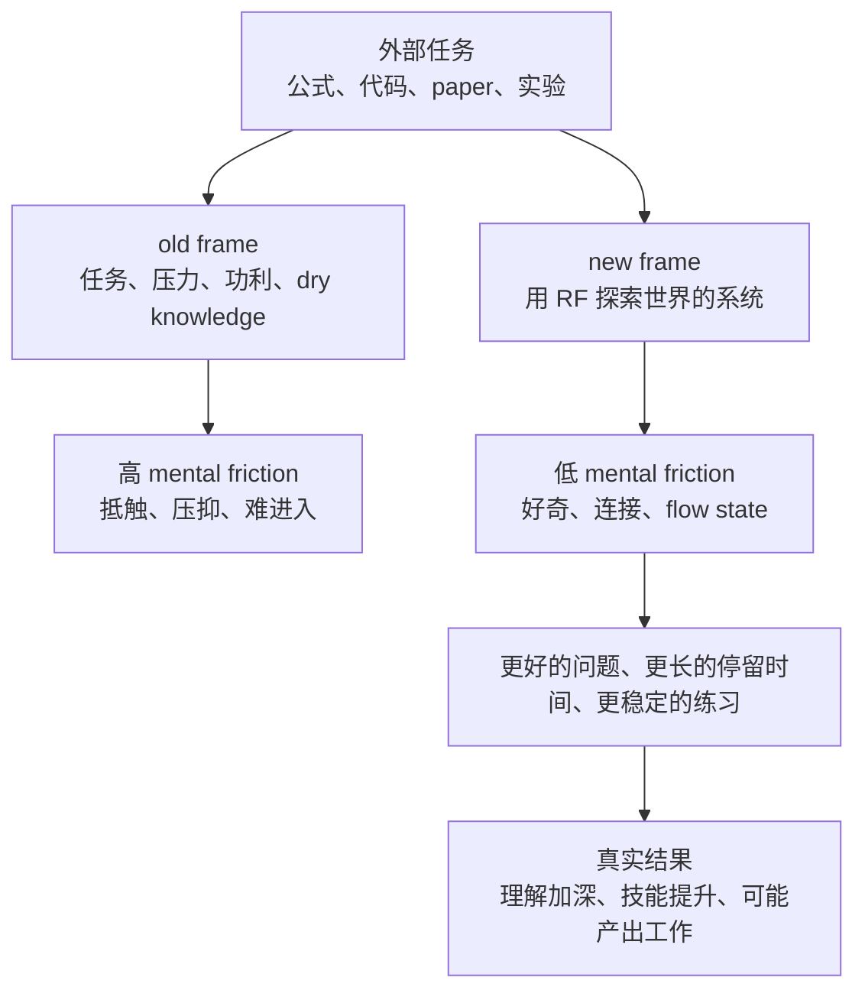

# meaning frame 如何改变雷达学习体验

相关笔记：[[2 why radar intuition matters]]

## Key takeaways

- 外部任务不一定变化，但 meaning frame 会改变自己和任务之间的关系。
- Feynman 改变高中物理体验的关键，不只是讲清知识，而是展示了一种看待物理的 perspective。
- radar intuition 有类似作用：它把雷达从 dry technical task 转换成一套用 RF 探索真实世界的系统。
- thought frame 不必被理解成直接改写现实；它可以通过 attention、emotion、practice、feedback 逐渐 materialize 成真实结果。
- 一个领域真正开始属于自己，往往不是从会推某个公式开始，而是从能用自己的语言和感受接住它开始。

---

## 1. 高中物理的类比

高中刚开始学习物理时，看到的可能只是：

```text
定律
公式
习题
考试
压力
```

这些东西如果只以任务和考试的形式出现，就很容易让人 mentally feel stressed。物理会显得枯燥、压抑、不爽，像是一套外部强加的要求。

后来读到 Richard Feynman 的自传 *Surely You're Joking, Mr. Feynman!*，以及 *The Feynman Lectures on Physics* 的一些章节之后，物理突然可以被另一种方式看待：

> **物理不是一堆要背的定律，而是一种用好奇心理解自然世界的方式。**

外部材料并没有发生本质变化。还是那些物理定律、公式、习题和考试。

真正变化的是：

- 这些知识在心里的意义；
- 自己和这些知识之间的关系；
- 面对公式和题目时的情绪状态；
- 对物理这件事的 identity 和 attention。

于是同样的知识不再只是压力来源，而变成了探索世界的工具。

---

## 2. 现在雷达学习中的对应关系

现在学习雷达时，也有类似的结构。

如果没有更高层的 intuition，雷达知识容易呈现为：

```text
信号处理
矩阵
概率统计
随机过程
硬件参数
波形设计
论文压力
代码实现
```

这些东西会显得 cold、dry、external，像是一堆必须掌握的技术任务。

但当雷达被理解成：

> **一种非人类视觉系统如何用 RF 波感知世界。**

同样的知识就获得了完全不同的心理含义。

这时，雷达不再只是公式和代码，而是一套 sensing system：

- 用波形去照亮世界；
- 用孔径去感知方向；
- 用相干处理去提取 delay、Doppler、angle；
- 用 detection 和 tracking 从 evidence 中建立 belief；
- 用 resource management 决定下一次应该看哪里。

所以学习雷达的意义，从：

> **我必须掌握一堆技术。**

变成：

> **我在理解一种用 RF 探索真实世界的方式。**

---

## 3. meaning frame 的作用

meaning frame 的作用，不是改变外部任务，而是改变自己和外部任务之间的关系。

外部仍然是：

```text
公式、代码、paper、实验、debug、推导、仿真
```

但 meaning frame 会改变：

- attention：自己会注意到什么；
- emotion：面对困难时是压抑还是好奇；
- identity：这是外部任务，还是自己正在探索的领域；
- motivation：是靠意志力硬撑，还是有内在吸引力；
- flow state：是否更容易进入长时间、低摩擦的专注状态。

这就是为什么同样一个公式，在不同 frame 下会有不同感受。

例如：

$$
y = H(x) + n
$$

如果 frame 是“我要背这个公式”，它只是负担。

如果 frame 是“传感器把真实世界状态 $x$ 通过观测机制 $H$ 投影成 measurement $y$，同时混入 noise $n$”，它就变成了理解 sensing 的入口。

> **外界看似没变，但心境变了；心境变了，注意力、问题选择、坚持时间和学习结果都会变。**



---

## 4. 关于 thought energy / materialization 的工程化理解

Reality Transurfing 里会说 thought energy has power，甚至会说它可以 materialize itself。

从工程和科学训练的角度，可以更谨慎地理解这句话：

> **thought frame 不一定直接改写外部现实，但它会改变注意力、解释方式、行动选择、坚持时间和反馈循环；这些变化长期积累后，会 materialize 成真实结果。**

也就是说，变化链条可以这样理解：

```text
thought frame
-> attention
-> emotion
-> action
-> practice
-> feedback
-> skill / output / result
```

这不是凭空显化，而是心理状态通过行为系统进入现实。

如果一个 topic 在心里只是“任务”，那么遇到困难时很容易产生抵触和逃避。

如果一个 topic 在心里是“一套探索世界的方式”，那么同样的困难更容易被解释成：

- 这里有一个真实问题；
- 这个模型为什么失败；
- 这个公式在描述哪个物理过程；
- 这个算法到底在 measurement space 里做了什么；
- 我能不能从另一个角度理解它。

这种解释方式会改变行为。

行为改变久了，结果自然也会变。

---

## 5. 最终 mental model

可以把这次讨论压缩成几句话：

- **外部任务不一定变化，但 meaning frame 会改变这些任务在心里的意义。**
- **一个领域真正开始属于自己，往往不是从会推某个公式开始，而是从能用自己的语言和感受接住它开始。**
- **Feynman 改变高中物理体验的关键，不只是讲清了知识，而是展示了一种看待物理的 attitude。**
- **现在的 radar intuition 也有类似作用：它把雷达从 dry technical task 变成一套用 RF 探索世界的系统。**
- **thought frame 的力量，体现在它会改变 attention、emotion、motivation、flow state 和长期行动。**
- **这种变化不直接替代 technical work，但会让 technical work 更可能持续、更有方向，也更可能产生真实结果。**

最短版本：

> **外界做的事情也许没有变，变的是自己和这件事之间的关系；当 radar 从一堆公式和代码变成“用 RF 探索世界的方式”时，学习就从压力任务变成了可以长期进入的探索。**
