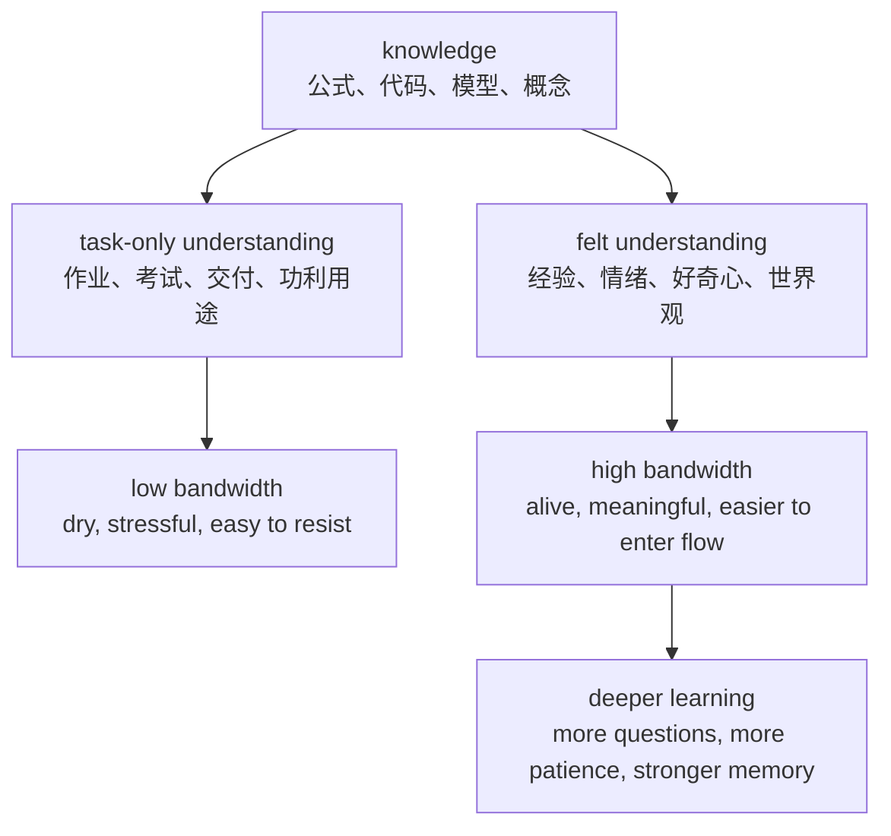

# don't try to understand knowledge, try to feel it.

相关笔记：[[1 radar as RF semantic projection]], [[2 why radar intuition matters]], [[3 meaning frame and radar learning]]

## Key takeaways

- 这里的 “understand” 指狭义的任务式理解：像应付作业、考试、工作交付一样处理 knowledge；它不是反对推导、做题、写代码。
- “feel the knowledge” 指让 knowledge 和自己的经验、情绪、好奇心、世界观建立连接。
- 当这种连接建立后，同样的 knowledge 进入大脑的带宽会变大，因为它不只走逻辑通道，也走情绪、记忆、审美、问题感和长期动机。
- 高中物理和现在学习雷达，其实是同一个机制的两个例子：外部知识没变，变的是自己和知识之间的关系。
- understanding gives structure; feeling gives life.

---

## 1. 这句话不是反理性

这句话：

> **don't try to understand knowledge, try to feel it.**

不是说不要理性理解，也不是说不要推公式、不要做题、不要写代码、不要做实验。

真正要反对的是一种很窄的 understanding mode：

```text
这个定义是什么？
这个公式怎么背？
这个题怎么做？
这个代码怎么跑？
这个任务怎么交付？
这个知识对我有什么功利用途？
```

这种理解方式当然有用，但如果只停在这里，knowledge 很容易变成 dry external information。

它看起来像：

- 作业；
- 考试；
- 任务；
- deadline；
- paper pressure；
- 工作交付；
- 某种外部系统要求自己掌握的东西。

在这种心态下，自己看到的往往只是知识的表象：定义、公式、步骤、题型、代码接口。知识会显得枯燥、冰冷、功利，也更容易带来 mental stress。

所以这里的意思不是：

> 不要 understand。

而是：

> **不要只用任务式、应付式、功利式的方式 understand knowledge。**

---

## 2. 什么是 feel the knowledge

feel the knowledge 的意思，是让 knowledge 和自己的内在世界建立连接。

这种连接可以是：

- 和自己的经验连接；
- 和自己的情绪连接；
- 和自己的好奇心连接；
- 和自己的审美连接；
- 和自己的世界观连接；
- 和自己想探索的问题连接。

当连接建立以后，knowledge 不再只是外部信息，而会变成内部可感的东西。

这时自己面对同样的公式、代码、模型、概念，会 feel 到完全不同的东西：

```text
这个公式在描述世界的哪个侧面？
这个模型为什么存在？
这个算法在替我看见什么？
这个知识和我对世界的好奇有什么关系？
我能不能感到它的必要性？
```

这就是 knowledge bandwidth 变大的原因。

狭义的 understanding 主要打开的是逻辑通道；feel the knowledge 会同时打开更多通道：

- logic；
- emotion；
- memory；
- curiosity；
- aesthetics；
- problem sense；
- bodily sense；
- long-term motivation。



---

## 3. 例子一：高中物理和 Feynman

高中刚开始学物理时，如果看到的只是：

```text
定律
公式
习题
考试
分数
```

物理就很容易变成一种外部压力。

这些知识没有和自己的好奇心、情绪、经验发生连接时，它们只是必须完成的学习任务。于是学习物理会让人感到压抑、枯燥、不爽。

后来读 Richard Feynman 的自传 *Surely You're Joking, Mr. Feynman!*，以及 *The Feynman Lectures on Physics* 的一些章节以后，物理突然获得了另一种 meaning frame：

> **物理不是一堆要背的定律，而是一种用好奇心理解自然世界的方式。**

外部知识没有变。牛顿定律还是牛顿定律，电磁学公式还是电磁学公式，习题和考试也仍然存在。

真正变化的是：

- 自己对物理的 attitude；
- 自己和物理知识之间的 relation；
- 看到公式时的情绪状态；
- 对物理问题的 curiosity；
- 对学习任务的 mental friction。

这就是 feel the knowledge 的典型例子。

知识没有变，但它从外部压力变成了内部探索。

---

## 4. 例子二：现在学习雷达

现在学习雷达也有类似的结构。

如果只用任务式 understanding 去看，雷达知识会呈现为：

```text
信号处理
矩阵
概率统计
随机过程
硬件参数
波形设计
CFAR
STAP
tracking
代码实现
paper pressure
```

这些东西很容易显得 cold、dry、technical、external。

但是当 radar 被理解成：

> **一种用 RF 波探索真实世界的 sensing system。**

同样的知识就开始变得可感。

这时：

- waveform 是雷达照亮世界的方式；
- aperture 是雷达感知方向的身体；
- pulse compression 是从延迟中提取距离；
- Doppler processing 是从相位旋转中提取运动；
- beamforming 是从 array-space phase pattern 中提取方向；
- CFAR 是在不确定背景中判断什么 evidence 值得注意；
- tracking 是把瞬时 evidence 变成时间上的 belief；
- resource management 是决定下一次应该用有限 sensing resource 去看哪里。

于是雷达不再只是公式、代码、算法和硬件参数，而是一套用 RF measurement space 去接触真实世界、压缩真实世界、推断真实世界的系统。

这就是从 understand radar knowledge 到 feel radar knowledge 的转变。

---

## 5. 最终 mental model

可以把这个 idea 压缩成几句话：

- **不要只把 knowledge 当成外部任务去处理；要让它和自己的经验、情绪、好奇心、世界观发生连接。**
- **understand knowledge 是看见它的结构；feel the knowledge 是感到它为什么存在、它在看见什么、它和自己有什么关系。**
- **当 knowledge 被 feel 到时，它不再只是 dry information，而会变成 alive understanding。**
- **高中物理和雷达学习的共同点是：外部材料没有质变，真正改变的是 meaning frame。**
- **meaning frame 改变后，同样的知识会进入更大的心理带宽，也更容易带来兴趣、耐心、问题感和 flow state。**

最短版本：

> **Don't try to understand knowledge, try to feel it.**

也就是：

> **不要只解析知识的结构；要让自己感到它为什么存在、它在探索什么、它和自己有什么关系。**
