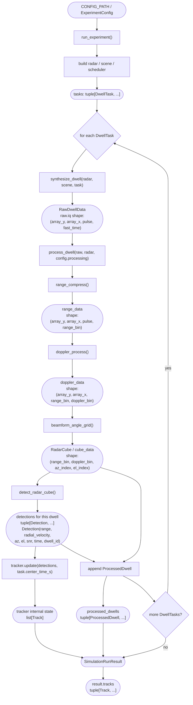

```mermaid
flowchart TD
    A(["CONFIG_PATH / ExperimentConfig"])
    B["run_experiment()"]
    C["build radar / scene / scheduler"]
    D(["tasks: tuple[DwellTask, ...]"])
    E{"for each DwellTask"}

    F["synthesize_dwell(radar, scene, task)"]
    G(["RawDwellData<br/>raw.iq shape:<br/>(array_y, array_x, pulse, fast_time)"])

    H["process_dwell(raw, radar, config.processing)"]

    I["range_compress()"]
    I_data(["range_data<br/>shape:<br/>(array_y, array_x, pulse, range_bin)"])

    J["doppler_process()"]
    J_data(["doppler_data<br/>shape:<br/>(array_y, array_x, range_bin, doppler_bin)"])

    K["beamform_angle_grid()"]
    K_data(["RadarCube / cube_data<br/>shape:<br/>(range_bin, doppler_bin, az_index, el_index)"])

    L["detect_radar_cube()"]
    M(["detections for this dwell<br/>tuple[Detection, ...]<br/>Detection(range, radial_velocity,<br/>az, el, snr, time, dwell_id)"])

    N["tracker.update(detections, task.center_time_s)"]
    O(["tracker internal state<br/>list[Track]"])

    P["append ProcessedDwell"]
    Q(["processed_dwells<br/>tuple[ProcessedDwell, ...]"])

    R{"more DwellTasks?"}
    S(["SimulationRunResult"])
    T(["result.tracks<br/>tuple[Track, ...]"])

    A --> B
    B --> C
    C --> D
    D --> E

    E --> F
    F --> G
    G --> H

    H --> I
    I --> I_data
    I_data --> J
    J --> J_data
    J_data --> K
    K --> K_data
    K_data --> L
    L --> M
    M --> N
    N --> O

    K_data --> P
    M --> P
    P --> Q

    P --> R
    R -- yes --> E
    R -- no --> S

    Q --> S
    O --> S
    S --> T

```
- 椭圆形： data
- 矩形：function 