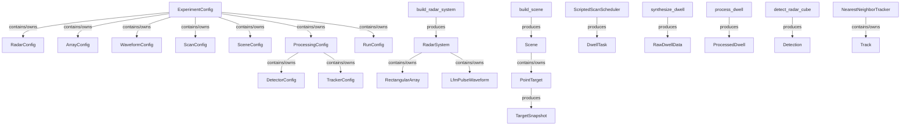
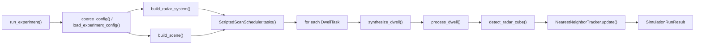

# Radar Basics Repo Analysis

分析时间：2026-05-08

验证状态：

- `uv run pytest`：13 passed
- 示例配置 `example_configs/architecture.yaml`：18 dwells, 18 detections, tracks = `[(1, "confirmed")]`, first cube shape = `(1000, 16, 5, 4)`

## 1. Mental Model

这个 repo 是一个教育用途的二维相控阵脉冲多普勒雷达仿真器。它不是追求真实雷达工程系统的完整复刻，而是把一个清晰的 radar signal processing mental model 写成可以运行、可以测试、可以在 notebook 中观察的 Python package。

最核心的链条是：

```text
truth -> dwell -> IQ -> cube -> detection -> track -> display
```

也就是：

1. `Scene / truth` 中有点目标，每个目标有位置、速度和 RCS。
2. `ScriptedScanScheduler` 生成一串固定扫描的 `DwellTask`。
3. 每个 dwell 由 `synthesize_dwell()` 合成 waveform-level multi-channel IQ。
4. `process_dwell()` 对 IQ 做 range compression、Doppler processing、angle beamforming。
5. `detect_radar_cube()` 在 radar cube 中找峰值，输出 detections。
6. `NearestNeighborTracker` 把 detections 转成 tracks。
7. `display.py` 提供 notebook / matplotlib 友好的可视化函数。

核心物理直觉：

```text
目标在 raw IQ 中表现为三个维度上的结构：

fast-time delay          -> range
slow-time phase rotation -> radial velocity / Doppler
array-space phase slope  -> azimuth / elevation
```

这个 repo 的主要价值就是把这三个结构从 raw IQ 一步步处理成 detection 和 track。

## 2. Class Model And Containment

### Major Classes

#### Config classes

位置：`src/radar_basics/config.py`

- `ExperimentConfig`
  - contains/owns: `RadarConfig`, `ArrayConfig`, `WaveformConfig`, `ScanConfig`, `SceneConfig`, `ProcessingConfig`, `RunConfig`
  - purpose: 端到端实验配置的根对象。
- `RadarConfig`
  - attributes: `carrier_frequency_hz`, `peak_tx_power_w`, `noise_figure_db`, `system_loss_db`, `temperature_k`
  - purpose: 雷达载频、发射功率和噪声/损耗参数。
- `ArrayConfig`
  - attributes: `num_y`, `num_x`, `spacing_y_m`, `spacing_x_m`
  - purpose: 矩形平面阵列几何配置。
- `WaveformConfig`
  - attributes: `bandwidth_hz`, `pulse_width_s`, `prf_hz`, `num_pulses`, `sample_rate_hz`
  - purpose: LFM pulse waveform 和 CPI 参数。
- `ScanConfig`
  - attributes: `azimuths_deg`, `elevations_deg`, `mode`
  - purpose: 固定二维 beam grid scan。
- `SceneConfig` / `TargetConfig`
  - purpose: 点目标 truth layer 配置。
- `ProcessingConfig`
  - contains/owns: `DetectorConfig`, `TrackerConfig`
  - purpose: 角度搜索 grid、detector、tracker 参数。

#### Radar hardware / waveform classes

位置：`src/radar_basics/radar.py`

- `RectangularArray`
  - attributes: `num_y`, `num_x`, `spacing_y_m`, `spacing_x_m`
  - methods: `positions_m`, `steering_vector()`, `transmit_field_gain()`
  - purpose: 描述 y-z 平面内的二维阵列；产生空间相位斜率。
- `LfmPulseWaveform`
  - attributes: `bandwidth_hz`, `pulse_width_s`, `prf_hz`, `num_pulses`, `sample_rate_hz`
  - methods: `pri_s`, `chirp_slope_hz_per_s`, `num_fast_time_samples`, `samples()`
  - purpose: 描述发射 LFM 脉冲和采样轴。
- `RadarSystem`
  - contains/owns: `RectangularArray`, `LfmPulseWaveform`
  - attributes: carrier/power/noise/loss/temperature
  - methods: `wavelength_m`, `range_resolution_m`, `velocity_resolution_mps`, `noise_power_w`
  - purpose: 聚合雷达硬件、波形和派生物理量。

#### Scenario classes

位置：`src/radar_basics/scenario.py`

- `PointTarget`
  - attributes: `name`, `position_m`, `velocity_mps`, `rcs_m2`
  - methods: `position_at()`, `velocity_at()`, `snapshot_at()`
  - produces: `TargetSnapshot`
  - purpose: constant-velocity point target。
- `TargetSnapshot`
  - attributes: `position_m`, `velocity_mps`, `range_m`, `az_deg`, `el_deg`, `radial_velocity_mps`, `rcs_m2`
  - purpose: 某个时间点的 target truth。
- `Scene`
  - contains/owns: `tuple[PointTarget, ...]`
  - methods: `snapshots_at()`
  - purpose: truth layer 容器。

#### Scheduler classes

位置：`src/radar_basics/scheduler.py`

- `DwellTask`
  - attributes: `id`, `mode`, `look_az_deg`, `look_el_deg`, `start_time_s`, `prf_hz`, `num_pulses`
  - methods/properties: `pri_s`, `duration_s`, `center_time_s`
  - purpose: 一个 CPI / dwell 的任务描述。
- `ScriptedScanScheduler`
  - attributes: `azimuths_deg`, `elevations_deg`, `prf_hz`, `num_pulses`, `mode`
  - methods: `tasks()`
  - produces: `tuple[DwellTask, ...]`
  - purpose: 固定 elevation-major scan grid。

#### Data container classes

位置：`src/radar_basics/data.py`

- `RawDwellAxes`
  - contains/owns: `fast_time_s`, `pulse_times_s`, `array_positions_m`
- `RawDwellData`
  - contains/owns: `iq`, `RawDwellAxes`, `DwellTask`, `tuple[TargetSnapshot, ...]`
  - purpose: waveform-level raw IQ 和 truth。
- `RadarCube`
  - contains/owns: `data`, `RadarCubeAxes`
  - shape: `(range, doppler, azimuth, elevation)`
- `ProcessedDwell`
  - contains/owns: `range_doppler_power`, `RadarCube`, `tuple[Detection, ...]`, `DwellTask`
- `SimulationRunResult`
  - contains/owns: config, tasks, raw dwells, processed dwells, tracks

#### Detection / tracking classes

位置：`src/radar_basics/detection.py`, `src/radar_basics/tracking.py`

- `Detection`
  - attributes: `range_m`, `radial_velocity_mps`, `az_deg`, `el_deg`, `snr_db`, `time_s`, `dwell_id`
  - purpose: radar cube 中检测到的一个峰值对应的量测。
- `Track`
  - attributes: `id`, `state_xyz_vxyz`, `covariance`, `status`, `last_update_s`, `hits`, `misses`
  - purpose: constant-velocity Kalman state。
- `NearestNeighborTracker`
  - contains/owns: internal `_tracks`, `_next_id`
  - depends on: `TrackerConfig`, `Detection`
  - methods: `update()`, `_predict()`, `_nearest_detection()`, `_correct()`, `_start_track()`
  - purpose: 最近邻 association + constant-velocity Kalman tracker。

### Class Relationship Graph



### Runtime Data Container Graph

```text
RawDwellData
  -> iq: complex ndarray, shape (num_y, num_x, num_pulses, num_fast_time)
  -> RawDwellAxes
  -> DwellTask
  -> TargetSnapshot[]

RadarCube
  -> data: complex ndarray, shape (range, doppler, azimuth, elevation)
  -> RadarCubeAxes

ProcessedDwell
  -> range_doppler_power
  -> RadarCube
  -> Detection[]
  -> DwellTask

SimulationRunResult
  -> ExperimentConfig
  -> DwellTask[]
  -> RawDwellData[]
  -> ProcessedDwell[]
  -> Track[]
```

## 3. Implementation Map

### Configuration layer

Files:

- `src/radar_basics/config.py`
- `example_configs/architecture.yaml`

Main functions:

```text
load_config()
-> load_experiment_config()
-> yaml.safe_load()
-> parse_experiment_config()
-> _parse_radar/_parse_array/_parse_waveform/_parse_scan/_parse_scene/_parse_processing/_parse_run
-> ExperimentConfig
```

Then:

```text
build_radar_system(ExperimentConfig) -> RadarSystem
build_scene(ExperimentConfig)        -> Scene
```

Important behavior:

- YAML 使用 degree；内部计算使用 SI units 和 radians where needed。
- array spacing 如果不提供，默认 half-wavelength。
- target 支持两种配置方式：
  - Cartesian: `position_m`, `velocity_mps`
  - spherical: `range_m`, `az_deg`, `el_deg`, `radial_velocity_mps`

### Truth / scene layer

Files:

- `src/radar_basics/scenario.py`
- `src/radar_basics/core.py`

Pipeline:

```text
PointTarget.position_at(t)
-> position_m0 + t * velocity_mps
-> cartesian_to_spherical()
-> radial_velocity_mps()
-> TargetSnapshot
```

这个 layer 负责把物理世界的 target truth 转换成 range / angle / radial velocity。

### Radar hardware / waveform layer

File:

- `src/radar_basics/radar.py`

Key concepts:

- `RectangularArray.positions_m`: 阵元在 radar y-z 平面中的位置。
- `RectangularArray.steering_vector()`: 目标方向导致的 array-space phase slope。
- `RectangularArray.transmit_field_gain()`: beam look direction 和 target direction 不一致时的发射场增益。
- `LfmPulseWaveform.samples()`: 生成 baseband LFM chirp。
- `RadarSystem.noise_power_w`: thermal noise power model。

### Operation / scheduler layer

File:

- `src/radar_basics/scheduler.py`

Pipeline:

```text
ScriptedScanScheduler.tasks()
-> for each scan cycle
-> for each elevation
-> for each azimuth
-> DwellTask(id, look_az_deg, look_el_deg, start_time_s, prf_hz, num_pulses)
```

这是一个固定 grid scheduler，不做 closed-loop resource management。

### Synthesis layer

File:

- `src/radar_basics/synthesis.py`

Main function:

```text
synthesize_dwell(radar, scene, task, rng) -> RawDwellData
```

核心步骤：

```text
initialize iq[num_y, num_x, num_pulses, num_fast_time]
for each target:
  for each pulse:
    snapshot = target.snapshot_at(task.start_time_s + pulse_time)
    delay_s = 2 * range / c
    valid fast-time samples = shifted_fast_time in pulse width
    transmit_field_gain = array gain from look direction to target direction
    received_power_w = radar equation approximation
    amplitude = sqrt(received_power_w) * transmit_field_gain
    propagation_phase = exp(-j * 4pi * range / wavelength)
    steering = array.steering_vector(target az/el)
    chirp = shifted LFM chirp
    iq += amplitude * propagation_phase * steering * chirp
add optional AWGN
return RawDwellData
```

这一层把 target truth 变成 raw complex IQ tensor。

### Processing layer

File:

- `src/radar_basics/processing.py`

Main function:

```text
process_dwell(raw, radar, config) -> ProcessedDwell
```

Sub-pipeline:

```text
range_compress()
-> matched filtering over fast-time

doppler_process()
-> FFT over pulse / slow-time
-> fftshift
-> move Doppler axis after range axis
-> build radial_velocity_mps axis

beamform_angle_grid()
-> for each az/el grid point
-> build steering vector
-> conventional digital beamforming
-> cube[range, doppler, azimuth, elevation]

detect_radar_cube()
-> detections

range_doppler_power = max(abs(cube)^2 over angle axes)
-> ProcessedDwell
```

这里的处理顺序是：

```text
raw IQ -> range compressed data -> Doppler data -> angle cube -> detections
```

### Detection layer

File:

- `src/radar_basics/detection.py`

Pipeline:

```text
power = abs(radar_cube.data)^2
background_power = median(positive power)
threshold_power = background_power * 10^(threshold_snr_db / 10)
candidate_indices = where(power > threshold)
sort candidates by power desc
for candidate:
  skip if suppressed by accepted detection within guard cells
  skip if not local maximum
  convert cube indices to physical axes
  create Detection
stop at max_detections_per_dwell
```

这是一个很适合教学的 detector：简单、可解释、和 radar cube 的物理轴直接对应。

### Tracking layer

File:

- `src/radar_basics/tracking.py`

Pipeline:

```text
NearestNeighborTracker.update(detections, time_s)
-> _predict() all tracks to current time
-> for each existing track:
     find nearest unassigned detection within association_gate_m
     if matched: _correct()
     else: misses += 1
-> for each unassigned detection: _start_track()
-> remove tracks whose misses > max_misses
-> return tracks
```

State:

```text
state_xyz_vxyz = [x, y, z, vx, vy, vz]
```

Measurement:

```text
Detection(range, az, el) -> spherical_to_cartesian() -> [x, y, z]
```

Note: 当前 tracker 没有直接把 `radial_velocity_mps` 放进 Kalman measurement，只用 position measurement 更新 state。

### Display layer

File:

- `src/radar_basics/display.py`

Functions:

- `plot_range_doppler(processed)`
- `plot_scan_beams(tasks)`
- `plot_air_picture(detections, tracks)`

这些函数是 notebook-friendly adapter，不参与核心仿真逻辑。

## 4. Function Pipeline And Call Graph

### Top-level call graph



### End-to-end pipeline

```text
run_experiment(config_or_path)
-> _coerce_config()
-> build_radar_system(config)
-> build_scene(config)
-> ScriptedScanScheduler(...).tasks(num_scan_cycles)
-> rng = np.random.default_rng(seed)
-> tracker = NearestNeighborTracker(config.processing.tracker)
-> for task in tasks:
     raw = synthesize_dwell(radar, scene, task, rng)
     processed = process_dwell(raw, radar, config.processing)
     tracker.update(processed.detections, task.center_time_s)
     optionally store raw
     store processed
-> SimulationRunResult(...)
```

### Synthesis call pipeline

```text
synthesize_dwell()
-> radar.waveform.fast_time_axis_s()
-> task pulse times
-> for target in scene.targets
     -> PointTarget.snapshot_at()
        -> position_at()
        -> velocity_at()
        -> cartesian_to_spherical()
        -> radial_velocity_mps()
     -> radar.array.transmit_field_gain()
     -> radar.array.steering_vector()
     -> build shifted chirp samples
     -> add to iq tensor
-> optional AWGN
-> scene.snapshots_at(task.center_time_s)
-> RawDwellData
```

### Processing call pipeline

```text
process_dwell()
-> range_compress()
   -> radar.waveform.samples()
   -> FFT convolution with matched filter
-> doppler_process()
   -> FFT over pulse axis
   -> fftshift
   -> radial velocity axis
-> beamform_angle_grid()
   -> array.steering_vector() for each angle
   -> tensordot conventional beamforming
-> RadarCube(...)
-> detect_radar_cube()
-> ProcessedDwell(...)
```

### Detection call pipeline

```text
detect_radar_cube()
-> abs(cube)^2
-> _estimate_background_power()
-> candidate thresholding
-> _is_suppressed()
-> _is_local_maximum()
   -> _neighborhood_slices()
-> Detection(...)
```

### Tracking call pipeline

```text
NearestNeighborTracker.update()
-> _predict()
-> _nearest_detection()
-> _correct()
-> _start_track()
-> prune old tracks
```

## 5. Tests As Behavioral Documentation

测试文件：

- `tests/test_config.py`
- `tests/test_simulator.py`

测试覆盖的核心行为：

- config YAML 可以被解析成 dataclasses。
- radar 默认 array spacing 是 half-wavelength。
- spherical target config 可以构造成 Cartesian target。
- scheduler 生成 elevation-major fixed scan。
- unexpected top-level YAML key 会报 `ConfigError`。
- array steering vector 的相位斜率符合预期。
- synthesized LFM echo 出现在正确 fast-time delay。
- 非零 radial velocity 会产生 slow-time phase progression。
- 多目标在无噪声时线性叠加。
- AWGN power 和配置的 thermal noise model 一致。
- full processing chain 可以检测单个 on-axis target。
- run_experiment 可以扫描并 confirmed track。
- display helpers 可以在 matplotlib Agg backend 下渲染。

这些测试说明当前 repo 的“可执行契约”不是工程级雷达真实性，而是教育级 signal chain 的正确性和可观察性。

## 6. How To Read This Repo

推荐阅读顺序：

1. `HUMAN.md`
   - 先建立整体 mental model。
2. `example_configs/architecture.yaml`
   - 看一次完整实验由哪些参数驱动。
3. `src/radar_basics/experiment.py`
   - 从 `run_experiment()` 读端到端流程。
4. `src/radar_basics/radar.py`
   - 理解阵列、波形、雷达派生物理量。
5. `src/radar_basics/scenario.py`
   - 理解 target truth 怎么随时间生成 snapshot。
6. `src/radar_basics/scheduler.py`
   - 理解 dwell 是如何被扫描调度出来的。
7. `src/radar_basics/synthesis.py`
   - 这是 raw IQ 的核心。
8. `src/radar_basics/processing.py`
   - 这是 IQ 到 radar cube 的核心。
9. `src/radar_basics/detection.py`
   - 理解 cube peak 怎么变成 detection。
10. `src/radar_basics/tracking.py`
   - 理解 detection 怎么变成 track。
11. `tests/test_simulator.py`
   - 用测试反向验证自己的 mental model。

## 7. Current V1 Limits

当前 V1 是一个刻意简化的 educational simulator。

已经支持：

- monostatic colocated TX/RX
- rectangular planar array
- narrowband steering
- LFM pulse waveform
- ideal point targets + AWGN
- conventional digital beamforming
- fixed scan grid
- threshold detection
- simple nearest-neighbor Kalman tracking

暂时不支持：

- clutter
- jamming / interference
- multipath
- analog beamforming
- adaptive beamforming
- multiple / staggered PRF ambiguity resolution
- closed-loop resource management
- real hardware I/O

实现上的一个重要简化：

- `Detection` 中有 `radial_velocity_mps`，但 `NearestNeighborTracker` 的 Kalman measurement 当前只使用 `range / az / el` 转出来的 Cartesian position，没有直接使用 radial velocity 更新 track velocity。

## 8. Summary

这个 repo 的设计很清楚：它把 phased-array pulse-Doppler radar 拆成几个干净的层：

```text
config
-> radar hardware / waveform
-> scene truth
-> scan operation
-> waveform synthesis
-> signal processing
-> detection
-> tracking
-> display
```

最值得抓住的主线是：

```text
一个点目标
-> 在 fast-time 形成 delay
-> 在 slow-time 形成 Doppler phase rotation
-> 在 array-space 形成 phase slope
-> 被 matched filter / FFT / beamforming 还原成 range / velocity / angle
-> 被 detector 变成 Detection
-> 被 tracker 变成 Track
```

只要这个主线不丢，后续扩展 clutter、jamming、adaptive beamforming、resource management 时，就可以明确判断新功能应该进入哪一层，而不是把所有细节塞进一个巨大的 simulator function。
